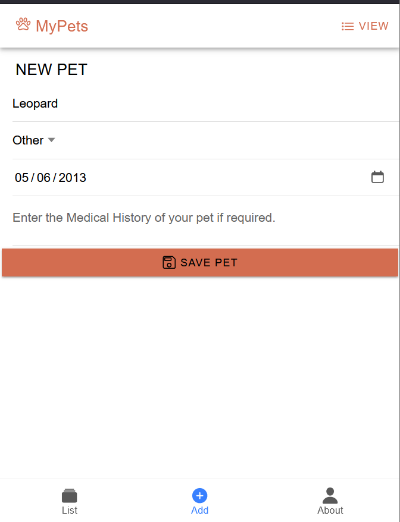
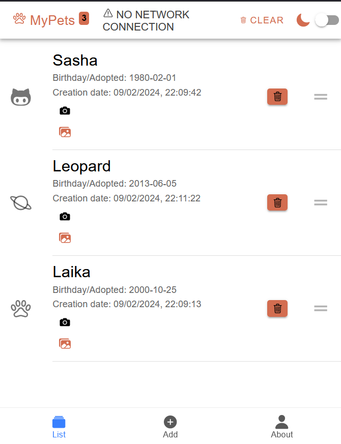
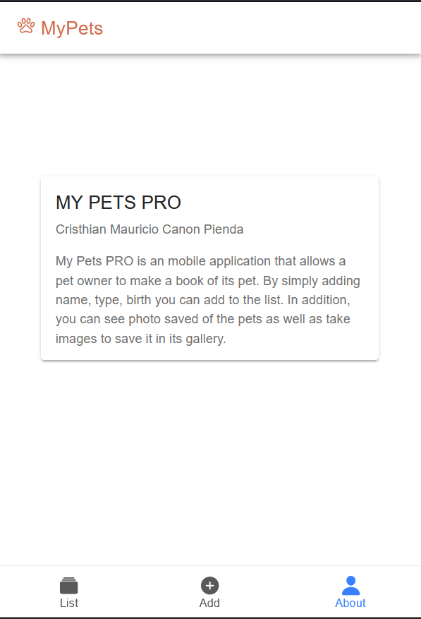
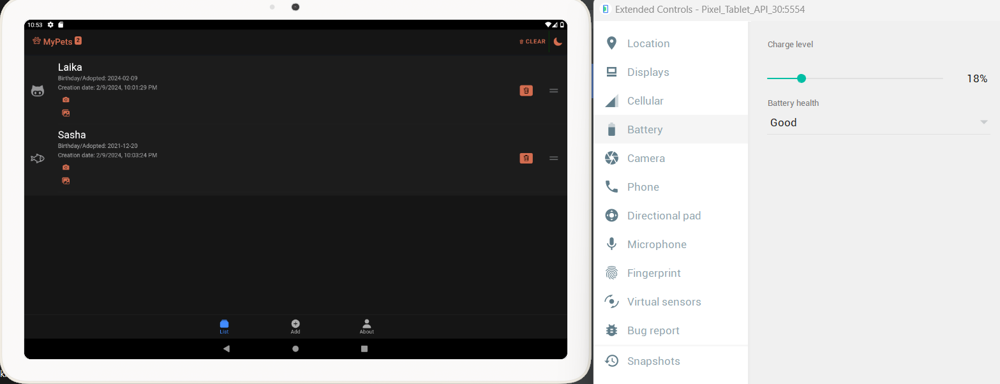
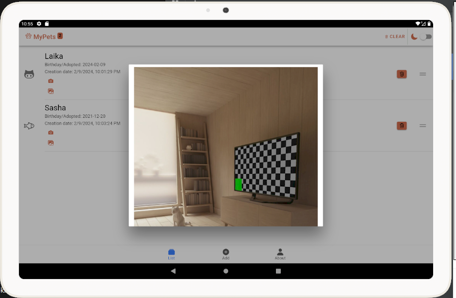
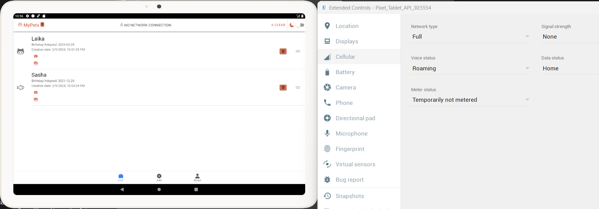

# MY PETS APPLICATION
This repository contains an application useful for vets to control pets that attends their veterinary.

The application has been made using web development technologies (HTML JavaScript ), IONIC framework for making it a cross-platform application. Then, using Cordova to create a container and plugins to use any device functions in several platforms.

## Overview
My pets pro application is divided by ion tabs, where you are able to see a list of pets booked, adding a pet and about tab to explain application's usage and owner.

#### 1. Add tab
When entering a pet to the booking system some information is required to be accepted

+ `Pet name` Indicates pet's name.
+ `Pet type` Selection of pet type.
+ `Date` Date indication when appointment was made.
+ `Comment` Details of medical history.

### 2. List tab
Once a pet is added, it is shown in list tab with the information provided.
+ Button to delete a pet from the list.
+ Dragging option to move pets accordingly.
+ Top toolbar indicating the quantity of pets listed. Clear button to delete every pet from list.

 

### 3. About tab
About tab that includes card information about developer and information related the application.

## Cordova Implentation
Cordova allows usage of several plugins to use functionalities of a plaftorm. The application made use of three plugins

#### 1. Battery Status
The application made use of battery usage to modify it from light to dark mode automaticalluy.

#### 2. Camera
Once the camera button is clicked in the list tab, it redicts you the plaftform camera. Then it saves the image file into a pet's modal

#### 3. Network information
Displays an alert if the platform is not connected to a network.

## Application implementation
<video width="320" height="240" controls>
  <source src="resources/myPetsPro.mp4" type="video/mp4">
</video>

